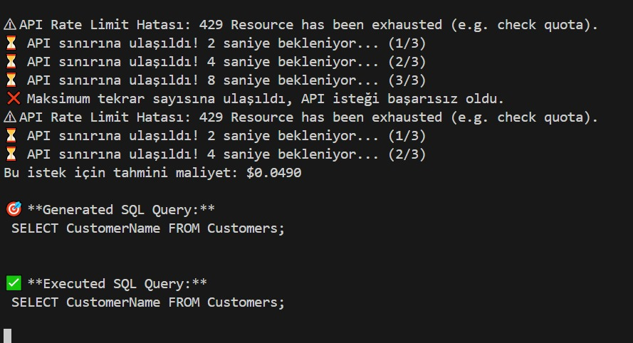

# Database Multi Agent Assistant

An advanced **LLM-powered multi-agent system** that queries SQLite databases using natural language. This project integrates **grounding techniques**, **secure prompt engineering**, and **database connectivity** to provide a professional and safe interface for database interaction. System support multi linugual prompts. you can easily test English&Turkish support for the system with chat_bot test prompt.txt .

---

## Project Purpose

This system allows users to query an SQLite database using **natural language** without requiring any SQL knowledge. It delivers accurate, grounded, and secure responses through a **multi-agent architecture** and **Google Gemini API**.

---

## Multi-Agent Architecture

###  **Agent Roles**

- **SQL Agent**: Converts user questions into **safe and valid** SQL queries using structured output.
- **Natural Language Agent**: Converts JSON database results into user-friendly natural language responses.
- **Orchestrator Agent**: Coordinates agents, manages context, and enforces security policies.

---

## Grounding Techniques

This system employs multiple grounding strategies to ensure accurate and secure outputs:

### 1. **Multi-Agent System**

- Agents with specialized roles (SQL generation, Natural Language processing, Orchestration).
- Separation of concerns → reduces hallucination risk and improves control.

---

### 2. **Structured Output (Prompt Engineering)**

- SQL Agent responses are constrained to **JSON format** with a predefined schema:

```json
{
  "sql_query": "SELECT SupplierName FROM Suppliers WHERE SupplierID = (SELECT SupplierID FROM Products ORDER BY Price DESC LIMIT 1);",
  "explanation": "Finds the supplier of the highest-priced product."
}
sql_generation_config = {
  "temperature": 0.1,   
  "top_p": 0.95,
  "top_k": 64,
  "max_output_tokens": 8192,
  "response_mime_type": "application/json",
  "response_schema": {
    "type": "object",
    "properties": {
      "sql_query": {
        "type": "string",
        "description": "Valid SQLite SELECT query"
      },
      "explanation": {
        "type": "string",
        "description": "Brief explanation of what the query does"
      }
    },
    "required": ["sql_query"]
  }
}
```

- Ensures consistent and machine-parseable responses.

---

### 3. **Context Injection (Prompt Engineering)**

- Agents are grounded with:
  - **Explicit database schema** embedded into prompts.
  - Clear rules for SQL generation and response formatting.
- Example:

```python
database_schema = """
- Categories: CategoryID, CategoryName, Description
- Customers: CustomerID, CustomerName, ContactName, Address, City, PostalCode, Country
- Products: ProductID, ProductName, SupplierID, CategoryID, Unit, Price
# ... other tables
"""
```

- This prevents the model from inventing non-existent tables or columns.

---

### 4. **Database Connection**

- Real-time grounding via actual SQLite database execution.
- SQL results are fetched directly from the database and converted to JSON.
- NL Agent uses **real query results** → no hallucination.

---

## Security Techniques

### **Layered Security Approach**

1. **Input Sanitization**

   - Detects and blocks **SQL injection** and **prompt injection** patterns.

2. **SQL Query Validation**

   - Only allows safe `SELECT` statements.
   - Blocks any query with `DROP`, `INSERT`, `UPDATE`, etc.

3. **Multi-Layer Prompt Injection Protection**

   - Guard lists prevent malicious attempts to manipulate the model.
   - Context enforcement ensures agents cannot reveal hidden instructions.

4. **Safe Database Execution**

   - Queries are validated before execution.
   - Errors are handled gracefully with user-friendly messages.

---
## Rate Limit Handling & Retry Logic

To manage API rate-limits and ensure high availability, the system includes **automatic retry** and **token usage monitoring**:

- **`api_request_with_retry`** function catches HTTP `429` (rate limit) errors and retries with **exponential backoff**.

- **Token tracking**:
  - **`count_tokens`** and **`get_token_usage`** monitor prompt and response tokens.
  - Global thresholds (`MAX_TOKENS`, `CONTEXT_WINDOW`, `WARNING_THRESHOLD`) trigger warnings if limits are approached.

### Example Screenshot of Rate Limit Error Handling



---

## Interface and Application

### **Gradio Web Interface**

- 💬 **Real-time Chat UI**
- 📊 **Smart CSV Export**
- 🔍 **Example Queries**
- 📱 **Mobile-Compatible Design**

---

## Workflow

```
User Query → Orchestrator Agent → SQL Agent (Structured Output)
 → Database (Real Query Execution) → JSON → NL Agent (Natural Language)
 → Secure Response
```

---

## Core Features

- **Natural Language → SQL Translation** (Turkish & English)
- **Structured Output** for safe and parseable queries
- **Context-Aware Querying** via prompt engineering
- **Automatic CSV Export**
- **Secure & Grounded Responses**

---

## Installation and Usage

### **Requirements**

```bash
pip install gradio google-generativeai python-dotenv pandas sqlite3
```

### **Environment Setup**

```bash
# .env file
GEMINIAPI=your_gemini_api_key
DB_PATH=path_to_your_database.db
```

### **Run the Application**

```bash
python chat_bot.py
```

---

## Example Usage

```
Who is the supplier of the highest priced product?
The highest priced product is Côte de Blaye, and its supplier is Aux joyeux ecclésiastiques.

Show all products in the 'Beverages' category.
Here are all products in the Beverages category: Chai, Chang, Guaraná Fantástica...
```

---

## Technical Details

- **LLM**: Google Gemini 2.5 Pro (Structured Output + Context Injection)
- **Database**: SQLite with schema-level validation
- **Security**: Multi-layer protection (sanitization, validation, filtering)
- **Grounding**: Real database connection ensures no hallucination

---

## Project Structure

```
├── chat_bot.py            # Main application
├── calculate_cost.py           # Retry logic and API handling
├── .env                   # API keys and DB config   
└── README.md             # Documentation
```
---

##  Why This Project is Unique?

- Combines **Multi-Agent LLM Architecture** with **real database grounding**
- Implements **state-of-the-art security techniques**
- Uses **Structured Output + Context Injection** for reliable responses
- Provides **automatic CSV export** and analytics

