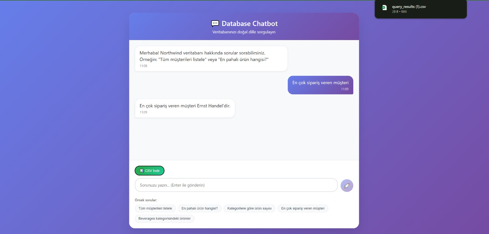
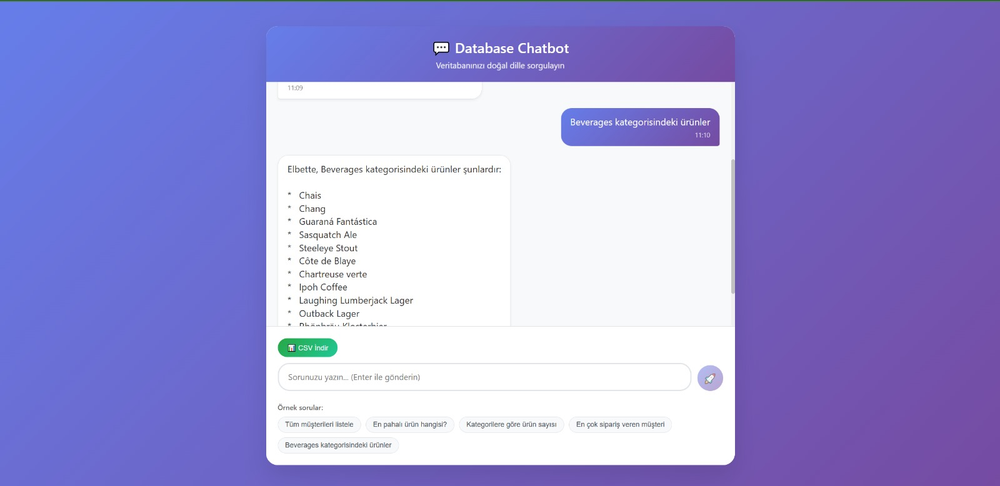
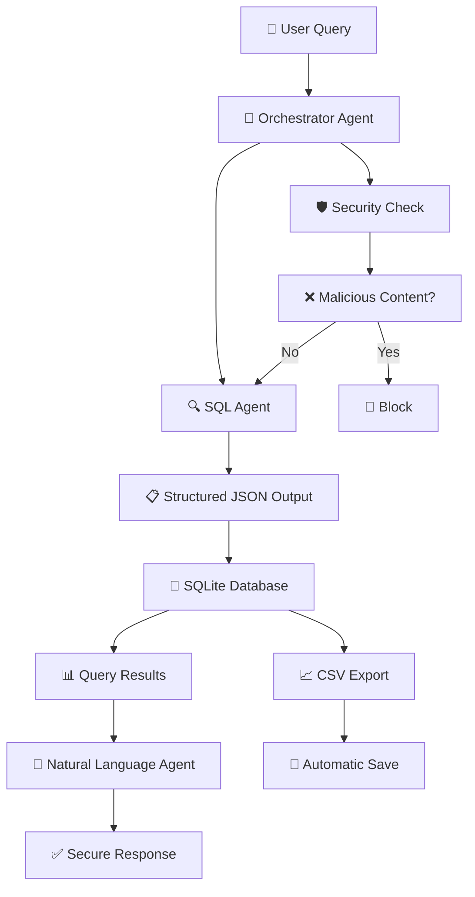

# 🤖 Database Assistant - Database Chatbot System


**Advanced LLM-powered multi-agent system** for querying SQLite databases using natural language - a professional web application. This project integrates **grounding techniques**, **secure prompt engineering**, and **database connectivity** to provide a safe and professional database interface. The system supports multilingual queries and can be tested in Turkish & English languages.

---

## 📋 Project Purpose and Features

This system allows users to query **SQLite databases using natural language** without requiring any SQL knowledge. It delivers accurate, reliable, and secure responses through **multi-agent architecture** and **Google Gemini API**.

### 🎯 Core Features

- **🗣️ Natural Language Processing**: Convert Turkish and English queries to SQL
- **🔒 Security-Focused**: Multi-layered security measures and SQL injection protection
- **📊 Automatic CSV Export**: Download query results in CSV format
- **🌐 Modern Web Interface**: React-based responsive user interface
- **⚡ Real-time Chat**: Instant messaging experience
- **🔄 Multi-Agent System**: Reliable results with specialized agents
- **📱 Mobile Compatible**: Responsive design that works on all devices

---

## 🏗️ System Architecture

### 🔧 Backend Architecture

The project uses a **3-tier hybrid architecture**:

#### **1. Node.js Express Backend (Port 3001)**
```
backend/
├── app.js              # Main Express application
├── routes/
│   └── api/
│       ├── chat.js     # Chat API endpoints
│       └── auth.js     # Authentication endpoints
├── services/
│   └── pythonBridge.js # Bridge to Python service
└── bin/www            # Server launcher
```

**Responsibilities:**
- RESTful API endpoints
- CORS and security middleware
- Proxy function to Python service
- Request validation and error handling

#### **2. Python Flask Microservice (Port 5001)**
```
python-service/
├── app.py                # Flask API server
├── chatbot_service.py    # Main chatbot logic
└── calculate_token.py    # Token calculation and rate limiting
```

**Responsibilities:**
- LLM API integration (Google Gemini)
- Multi-agent orchestration
- SQLite database operations
- CSV file creation and management

#### **3. React Frontend (Port 3000)**
```
frontend/src/
├── App.js        # Main React component
├── App.css       # Styling
└── index.js      # Entry point
```

**Responsibilities:**
- User interface
- Real-time chat experience
- CSV download operations
- Responsive design

### 🤖 Multi-Agent Chatbot System

The system uses **3 specialized agents**:

#### **Agent Roles**

- **🔍 SQL Agent**: Converts natural language questions into **safe and valid** SQL queries (Structured Output)
- **📝 Natural Language Agent**: Converts JSON database results into user-friendly natural language responses
- **🎯 Orchestrator Agent**: Coordinates agents, manages context, and enforces security policies

---

## 🧠 Grounding Techniques and Reliability

The system employs multiple grounding strategies to ensure accurate and secure outputs:

### 1. **🔄 Multi-Agent System**

- Agents with specialized roles (SQL generation, Natural Language processing, Orchestration)
- Separation of concerns → reduces hallucination risk and improves control

### 2. **📋 Structured Output (Prompt Engineering)**

SQL Agent responses are constrained to **predefined JSON schema**:

```json
{
  "sql_query": "SELECT SupplierName FROM Suppliers WHERE SupplierID = (SELECT SupplierID FROM Products ORDER BY Price DESC LIMIT 1);",
  "explanation": "Finds the supplier of the highest-priced product."
}
```

**Configuration:**
```python
sql_generation_config = {
  "temperature": 0.1,   
  "top_p": 0.95,
  "top_k": 64,
  "max_output_tokens": 8192,
  "response_mime_type": "application/json",
  "response_schema": {
    "type": "object",
    "properties": {
      "sql_query": {"type": "string", "description": "Valid SQLite SELECT query"},
      "explanation": {"type": "string", "description": "Brief explanation of what the query does"}
    },
    "required": ["sql_query"]
  }
}
```

### 3. **🎯 Context Injection (Prompt Engineering)**

Agents are supported with:
- **Explicit database schema** embedded into prompts
- Clear rules for SQL generation and response formatting

```python
database_schema = """
Northwind database schema:
- Categories: CategoryID, CategoryName, Description
- Customers: CustomerID, CustomerName, ContactName, Address, City, PostalCode, Country
- Products: ProductID, ProductName, SupplierID, CategoryID, Unit, Price
# ... other tables
"""
```

This approach prevents the model from inventing non-existent table or column names.

### 4. **💾 Real Database Connection**

- Real-time grounding via actual SQLite database execution
- SQL results are fetched directly from the database and converted to JSON
- NL Agent uses **real query results** → no hallucination

---

## 🛡️ Security Techniques

### **Layered Security Approach**

1. **🔍 Input Sanitization**
   - Detects and blocks **SQL injection** and **prompt injection** patterns
   - Malicious content filtering

2. **✅ SQL Query Validation**
   - Only accepts safe `SELECT` statements
   - Blocks dangerous commands like `DROP`, `INSERT`, `UPDATE`

3. **🛡️ Multi-Layer Prompt Injection Protection**
   - Guard lists prevent malicious attempts to manipulate the model
   - Context enforcement prevents agents from revealing hidden instructions

4. **🔒 Safe Database Execution**
   - Queries are validated before execution
   - Errors are handled gracefully with user-friendly messages

---

## ⚡ Rate Limit Management & Retry Logic

To manage API rate limits and ensure high availability, the system includes **automatic retry** and **token usage monitoring**:

- **`api_request_with_retry`** function catches HTTP `429` (rate limit) errors and retries with **exponential backoff**

- **Token tracking**:
  - **`count_tokens`** and **`get_token_usage`** monitor prompt and response tokens
  - Global thresholds (`MAX_TOKENS`, `CONTEXT_WINDOW`, `WARNING_THRESHOLD`) trigger warnings when limits are approached

### Rate Limit Error Handling Example


---

## 🌐 Web Interface and Technologies

### **React-Based Modern Interface**

- 💬 **Real-time Chat UI**: Instant messaging experience
- 📊 **Smart CSV Export**: Automatic download of query results
- 🔍 **Example Queries**: Ready-to-use examples
- 📱 **Mobile-Compatible Design**: Responsive UI
- ⚡ **Loading States**: Loading indicators for user experience
- 🎨 **Modern CSS**: Gradients and animations

### **Why Flask Was Chosen?**

Reasons for using Flask in the Python microservice:

1. **🚀 Lightweight and Fast**: Minimal overhead, fast API responses
2. **🔧 Flexibility**: Easy customization for LLM integration
3. **📚 Rich Ecosystem**: Google Generative AI, SQLite, Pandas integration
4. **🐍 Python Advantages**: Natural compatibility with AI/ML libraries
5. **⚙️ Microservice Compatibility**: Easy integration with Node.js backend
6. **🔄 RESTful API**: Clean architecture with standard HTTP endpoints

---

## 🔄 System Workflow



**Detailed Workflow:**
1. **User Query** → Sent from React frontend
2. **Node.js Backend** → Routes request to Python microservice
3. **Orchestrator Agent** → Security check and routing
4. **SQL Agent** → Converts natural language to SQL in JSON format
5. **SQLite Database** → Real query execution
6. **NL Agent** → Converts JSON results to natural language
7. **CSV Export** → Results automatically saved to CSV

---

## 🎯 Core Features Detail

- **🗣️ Natural Language → SQL Translation**: Turkish and English support
- **📋 Structured Output**: Safe and parseable queries
- **🎯 Context-Aware Querying**: Context awareness through prompt engineering
- **📊 Automatic CSV Export**: Instant download of results
- **🔒 Secure & Reliable Responses**: Protected with multi-layer security

---

## 🚀 Installation and Usage

### **System Requirements**

#### Backend (Node.js):
```bash
npm install express cors axios dotenv morgan express-validator jsonwebtoken uuid
```

#### Python Microservice:
```bash
pip install flask flask-cors google-generativeai python-dotenv pandas sqlite3
```

#### Frontend (React):
```bash
npm install react react-dom axios
```

### **Environment Setup**

Create `.env` file:
```bash
# Google Gemini API
GEMINIAPI=your_gemini_api_key

# Database
DB_PATH=./Northwind.db

# Service URLs
FRONTEND_URL=http://localhost:3000
PYTHON_SERVICE_URL=http://localhost:5001
```

### **Running the Application**

1. **Start Python Microservice:**
```bash
cd python-service
python app.py
# Runs on port 5001
```

2. **Start Node.js Backend:**
```bash
cd backend
npm start
# Runs on port 3001
```

3. **Start React Frontend:**
```bash
cd frontend
npm start
# Runs on port 3000
```

### **Usage Examples**

```
🇹🇷 Turkish:
"En pahalı ürünün tedarikçisi kim?" (Who is the supplier of the most expensive product?)
→ En yüksek fiyatlı ürün Côte de Blaye ve tedarikçisi Aux joyeux ecclésiastiques.

"Beverages kategorisindeki tüm ürünleri göster" (Show all products in Beverages category)
→ Beverages kategorisindeki ürünler: Chai, Chang, Guaraná Fantástica...

🇺🇸 English:
"Show all customers from Germany"
→ Here are all customers from Germany: Alfreds Futterkiste, Blauer See Delikatessen...
```

---

## 🔧 Technical Details

- **🤖 LLM**: Google Gemini 2.5 Pro (Structured Output + Context Injection)
- **💾 Database**: SQLite with schema-level validation
- **🛡️ Security**: Multi-layer protection (sanitization, validation, filtering)
- **🎯 Grounding**: Real database connection prevents hallucination
- **🌐 Frontend**: React 19.1.1 + Modern CSS
- **⚡ Backend**: Node.js Express + Flask microservice
- **📊 Export**: CSV generation with Pandas

---

## 📁 Project Structure

```
Database-Assistant/
├── 📁 backend/                    # Node.js Express API
│   ├── app.js                     # Main Express application
│   ├── routes/api/
│   │   ├── chat.js                # Chat endpoints
│   │   └── auth.js                # Auth endpoints
│   ├── services/
│   │   └── pythonBridge.js        # Python service bridge
│   └── package.json
│
├── 📁 frontend/                   # React Web Interface
│   ├── src/
│   │   ├── App.js                 # Main React component
│   │   ├── App.css                # Styling
│   │   └── index.js               # Entry point
│   └── package.json
│
├── 📁 python-service/             # Flask Microservice
│   ├── app.py                     # Flask API server
│   ├── chatbot_service.py         # Main chatbot logic
│   ├── calculate_token.py         # Token management
│   └── query_results/             # CSV outputs
│
├── 📄 Northwind.db               # SQLite database
├── 📄 .env                       # Environment variables
└── 📄 README.md                  # This documentation
```

---

## 🌟 What Makes This Project Unique

- **🔗 Hybrid Architecture**: Multi-Agent LLM Architecture + real database grounding
- **🛡️ Advanced Security**: State-of-the-art security techniques
- **📋 Structured Output**: Reliable responses with Context Injection
- **📊 Smart Analytics**: Automatic CSV export and data analysis
- **🌐 Modern Web Stack**: React + Node.js + Flask microservice architecture
- **🗣️ Multilingual Support**: Turkish and English natural language processing
- **⚡ Real-time Experience**: WebSocket-like fast response times

